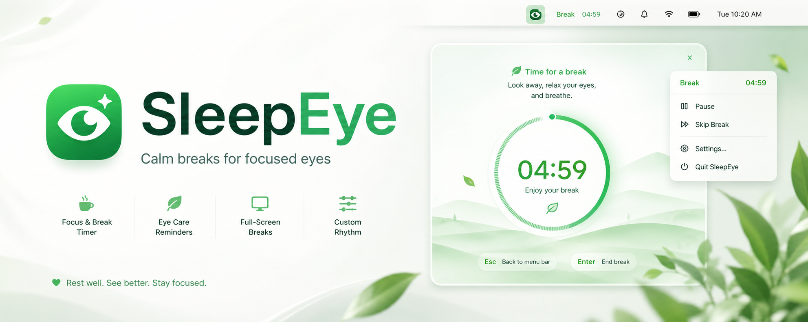

<p align="center">
  
</p>

# SleepEye

SleepEye is a calm macOS menu bar break timer for people who stare at screens for too long.

It starts small in the menu bar, then opens a soft white-green full-screen rest countdown when it is time to look away. The product is intentionally local, lightweight, and respectful: no account, no cloud sync, no forced lock-in.

## Features

- Menu bar timer for focus and eye-care breaks.
- Built-in rhythms: 25 / 5, 50 / 10, and 20-20-20.
- Custom work and break durations.
- Full-screen rest countdown that opens automatically by default.
- Gentle top reminder strip as a fallback.
- Pause, resume, skip, extend, and stop controls.
- Local settings with `UserDefaults`.
- Core timer logic isolated from SwiftUI/AppKit for testability.

## Run From Source

Requirements:

- macOS
- Xcode command line tools
- Swift 5.9 or newer

```bash
cd /Users/jerry/Code/project/SleepEye
env CLANG_MODULE_CACHE_PATH=.build/clang-module-cache swift run --cache-path .build/swiftpm-cache SleepEye
```

After launch, look for `SleepEye` in the macOS menu bar.

## Test

```bash
env CLANG_MODULE_CACHE_PATH=.build/clang-module-cache swift test --cache-path .build/swiftpm-cache
```

## Design Principles

- Rest should be easy to accept, not annoying.
- Full-screen rest is the main experience; the top strip is only a gentle fallback.
- Users must always have an exit: Enter ends the break, Esc returns to the reminder strip.
- Timer accuracy uses target end times instead of naive per-second decrementing.
- AppKit details stay inside small controllers; SwiftUI views stay presentation-focused.

## Roadmap

- Build a signed `.app` bundle.
- Add app icon and release packaging.
- Add daily lightweight stats.
- Re-enable system notifications for packaged `.app` builds.

## Contributing

See [CONTRIBUTING.md](CONTRIBUTING.md).

## License

MIT
